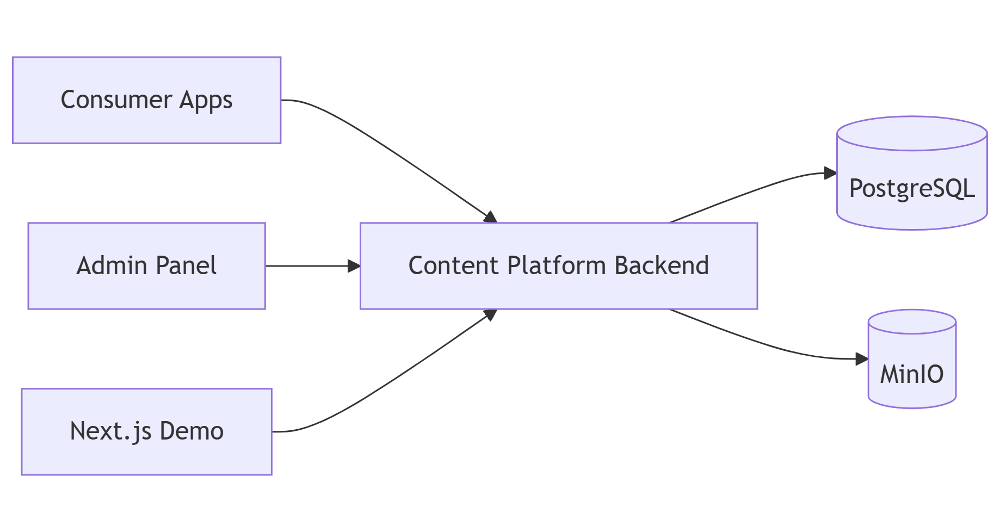

# content-platform

پلتفرم چندمستاجری مدیریت محتوا با PostgreSQL و MinIO، همراه با پنل مدیریت React و اپلیکیشن مصرف‌کننده نمونه.

[English](README.md)



## سرویس‌های زمان اجرا

- Backend API: `http://localhost:3001`
- Admin UI: `http://localhost:3002`
- Demo UI: `http://localhost:3003`
- PostgreSQL: `localhost:5432`
- MinIO API: `localhost:9000`
- MinIO Console: `localhost:9001`

## معماری دسترسی محتوا

این پلتفرم multi-tenant است. هر tenant یا پروژه مصرف‌کننده با یک `applicationId` شناخته می‌شود.

### پنل مدیریت

- کاربر ادمین با Bearer JWT وارد پنل مدیریت می‌شود.
- هر ادمین می‌تواند به یک یا چند application دسترسی داشته باشد.
- کاربران غیر super admin فقط محتوای applicationهای مجاز خودشان را مدیریت می‌کنند.
- APIهای مدیریتی وابسته به tenant، application انتخاب‌شده را از هدر `X-Application-Id` دریافت می‌کنند و backend دسترسی کاربر به آن را بررسی می‌کند.
- محتوا، رسانه‌ها، کالکشن‌ها، تنظیمات sitemap، آنالیتیکس و رکوردهای audit با `applicationId` مالک ذخیره می‌شوند.

### سمت سرور پروژه مصرف‌کننده

پروژه مصرف‌کننده نباید credentialهای content-platform را به مرورگر کاربر بدهد. این مقادیر باید فقط سمت سرور نگهداری شوند:

```bash
CONTENT_PLATFORM_API_BASE_URL=http://localhost:3001
CONTENT_PLATFORM_APPLICATION_ID=<application-id>
CONTENT_PLATFORM_API_TOKEN=<application-token>
```

سرور مصرف‌کننده محتوای منتشرشده را با این headerها دریافت می‌کند:

```http
X-Application-Id: <application-id>
X-Application-Token: <application-token>
```

توکن application تا وقتی rotate یا revoke نشود معتبر می‌ماند:

```http
POST /api/v1/admin/applications/{id}/token/rotate
POST /api/v1/admin/applications/{id}/token/revoke
```

## صفحه‌ها و منوها

فیچر صفحه و منو برای مدیریت routeهای سایت مصرف‌کننده از داخل content-platform استفاده می‌شود. این فیچر در هر دو نسخه backend، یعنی NestJS و Java، با contract یکسان پیاده‌سازی شده تا پنل ادمین بتواند بدون تغییر با هر دو کار کند.

از Page برای مسیرهای مستقل سایت استفاده کنید، مثل:

- `/fa/about`
- `/fa/contact`
- `/fa/about-me-2`
- `/en/about`

از Menu برای تعریف ساختار navigation سایت استفاده کنید. آیتم منو می‌تواند به route ثابت، صفحه مدیریت‌شده، مقاله، پست، گالری یا لینک خارجی اشاره کند.

مزیت اصلی این مدل این است که اگر تیم frontend فردا یک component جدید برای مسیری مثل `/fa/about-me-2` بسازد، لازم نیست کد منو تغییر کند. ادمین وارد بخش مدیریت منو در content-platform می‌شود، route جدید را تعریف می‌کند و پروژه مصرف‌کننده آن را از API منو دریافت می‌کند.

در خروجی API عمومی منو، هر آیتم یک فیلد `dynamic` دارد:

- `dynamic: false`: مسیر یک route عادی در پروژه مصرف‌کننده است.
- `dynamic: true`: محتوای این route باید از content-platform دریافت شود و داخل layout و style یکپارچه پروژه مصرف‌کننده نمایش داده شود.

### APIهای مدیریت صفحه

```http
POST /api/v1/admin/pages
PUT /api/v1/admin/pages/{id}
PATCH /api/v1/admin/pages/{id}/status
GET /api/v1/admin/pages/{id}
GET /api/v1/admin/pages?applicationId={applicationId}
```

### APIهای مدیریت منو

```http
POST /api/v1/admin/menus
POST /api/v1/admin/menus/from-routes
PUT /api/v1/admin/menus/{id}
PATCH /api/v1/admin/menus/{id}/status
DELETE /api/v1/admin/menus/{id}
GET /api/v1/admin/menus/{id}
GET /api/v1/admin/menus
GET /api/v1/admin/menus/routes
PUT /api/v1/admin/menus/routes/sync
POST /api/v1/admin/menus/{id}/items
PUT /api/v1/admin/menus/{id}/items/layout
PUT /api/v1/admin/menus/{id}/items/{itemId}
DELETE /api/v1/admin/menus/{id}/items/{itemId}
GET /api/v1/admin/menus/{id}/published-content
POST /api/v1/admin/menus/{id}/sync-published
```

### APIهای عمومی صفحه و منو

```http
GET /api/v1/content/pages
GET /api/v1/content/pages/slugs
GET /api/v1/content/pages/{languageCode}/{slug}
GET /api/v1/content/menus/location/{languageCode}/{location}
GET /api/v1/content/menus/{languageCode}/{code}
```

این APIها همان headerهای consumer delivery را می‌خواهند:

```http
X-Application-Id: <application-id>
X-Application-Token: <application-token>
```

## کالکشن‌ها

Collection برای چیدمان دستی و editorial محتوا در یک application استفاده می‌شود. به جای ساخت مفهوم‌های جدا مثل slider، hero، carousel، banner یا featured block، همه این‌ها با collection و `presentation.type` نمایش داده می‌شوند.

نمونه‌ها:

- `homepage-featured`
- `main-slider`
- `recommended-posts`
- `landing-hero`
- `landing-banner`

دریافت کالکشن از delivery API:

```http
GET /api/v1/content?collection=homepage-featured
GET /api/v1/content/collections/homepage-featured
```

## پروکسی رسانه

MinIO storage خصوصی است و نباید URL مستقیم MinIO به مرورگر داده شود. URL رسانه‌ها باید از backend proxy عبور کند:

```http
http://localhost:3001/media/{applicationId}/...
```

برای URL عمومی backend/proxy:

```bash
CONTENT_PLATFORM_BASE_URL=http://localhost:3001
PUBLIC_BASE_URL=http://localhost:3001
MEDIA_BASE_PATH=/media
```

## تنظیمات CORS

دامنه‌های مجاز پنل مدیریت را به‌صورت comma-separated تعریف کنید:

```bash
CORS_ALLOWED_ORIGINS=http://localhost:3002,http://localhost:5173
```

نمونه Production:

```bash
CORS_ALLOWED_ORIGINS=https://cms.magigateac.com
```

درخواست‌های بدون هدر `Origin` مانند curl و health check مجاز می‌مانند. در production، اگر `CORS_ALLOWED_ORIGINS` تعریف نشده باشد، درخواست‌های cross-origin مرورگر رد می‌شوند.

## راهنمای کامل مدیریت منو

Content Platform بین **Routeهای اپلیکیشن** و **منوی نهایی** تفاوت قائل می‌شود. این جداسازی باعث می‌شود deploy یک tenant تصمیم‌های مدیر محتوا درباره ساختار منو را بازنویسی نکند و پلتفرم نیز چندمستاجری باقی بماند.

### مفاهیم اصلی

- **Application یا Tenant**: مالک Routeها، منوها، صفحه‌ها و محتوا است و با `applicationId` شناخته می‌شود.
- **Tenant Route**: مسیری است که در کد اپلیکیشن مصرف‌کننده پیاده‌سازی شده، مانند `/{locale}/about`.
- **Route Manifest**: قراردادی است که tenant از طریق آن Routeهای کدنویسی‌شده خود را اعلام می‌کند.
- **Menu**: ظرف navigation مخصوص یک زبان که در Content Platform ذخیره می‌شود.
- **Menu Item**: یک آیتم مرتب‌شده داخل منو که می‌تواند با `parentId` زیرمجموعه آیتم دیگری باشد.
- **Delivery Menu**: منوی فعال و فیلترشده‌ای که به سایت مصرف‌کننده تحویل داده می‌شود.

Route و Menu دو رکورد متفاوت هستند. همگام‌سازی manifest فقط رجیستری Routeها را به‌روزرسانی می‌کند و هیچ منوی موجودی را به‌صورت پنهانی بازنویسی نمی‌کند.

### فیلدهای منو

| فیلد | کاربرد |
| --- | --- |
| `applicationId` | tenant مالک منو. در درخواست‌های ادمین معمولاً با `X-Application-Id` ارسال می‌شود. |
| `code` | شناسه فنی و ثابت منو که سایت مصرف‌کننده از آن استفاده می‌کند؛ مانند `main-menu`. |
| `title` | نام نمایشی منو در پنل؛ مانند «منوی اصلی». |
| `languageCode` | زبان منو: `fa`، `en`، `ar`، `zh` یا `ru`. |
| `location` | محل پیشنهادی نمایش: `HEADER`، `FOOTER`، `SIDEBAR` یا `MOBILE`. |
| `status` | منوی `ACTIVE` از Delivery API قابل دریافت است؛ منوی `INACTIVE` نگهداری می‌شود ولی عمومی نیست. |

ترکیب `applicationId + code + languageCode` باید یکتا باشد. `code` یک قرارداد API است؛ تغییر آن نیازمند اصلاح درخواست سایت مصرف‌کننده است.

نمونه کدهای مناسب:

```text
main-menu
footer-menu
mobile-menu
```

نمونه دریافت منو:

```http
GET /api/v1/content/menus/fa/main-menu
```

### انواع آیتم منو و مالکیت

| نوع | کاربرد | مالک مدیریت |
| --- | --- | --- |
| `TENANT_ROUTE` | Route پیاده‌سازی‌شده در کد tenant | `TENANT` |
| `PAGE` | صفحه داینامیک CMS | `CMS` |
| `ARTICLE` | مقاله منتشرشده | `CMS` |
| `POST` | پست منتشرشده | `CMS` |
| `GALLERY` | گالری منتشرشده | `CMS` |
| `CUSTOM_URL` | آدرس داخلی که مدیر وارد کرده | `ADMIN` |
| `EXTERNAL_URL` | لینک خارجی | `ADMIN` |
| `GROUP` | والد ساختاری بدون مقصد | `ADMIN` |

فیلدهای مهم هر آیتم:

- `referenceId`: شناسه Route یا محتوای متصل‌شده.
- `url`: مقصد نهایی آیتم.
- `target`: مقدار `SELF` یا `BLANK`.
- `sortOrder`: ترتیب آیتم میان فرزندان یک والد.
- `parentId`: والد اختیاری برای ساخت منوی چندسطحی.
- `isVisible`: وضعیت نمایش که مدیر کنترل می‌کند.
- `source` و `sourceKey`: منبع و کلید ثابت Route اپلیکیشن.
- `managedBy`: یکی از `TENANT`، `CMS` یا `ADMIN`.
- `dynamic`: مشخص می‌کند آیتم به Route ثبت‌شده یا محتوای مدیریت‌شده متصل است.

### ساختار Route Manifest

Manifest فقط Routeهایی را توصیف می‌کند که در کد tenant وجود دارند. Manifest منوی نهایی نیست و محل نمایش، ساختار والد و فرزند، visibility یا فعال بودن منو را تعیین نمی‌کند.

```json
{
  "source": "tenant-web",
  "replaceMissing": true,
  "routes": [
    {
      "key": "home",
      "path": "/{locale}",
      "titles": {
        "fa": "خانه",
        "en": "Home"
      },
      "icon": "home",
      "cssClass": "nav-home",
      "metadata": {
        "section": "primary"
      }
    },
    {
      "key": "about",
      "path": "/{locale}/about",
      "titles": {
        "fa": "درباره ما",
        "en": "About"
      }
    }
  ]
}
```

قواعد manifest:

- `source` تولیدکننده Routeها را مشخص می‌کند؛ مانند `magical-bank-web`.
- `key` باید در همان source ثابت باشد.
- `path` می‌تواند از placeholderهای `{locale}` یا `{languageCode}` استفاده کند.
- `titles` عنوان Route را برای زبان‌های مختلف نگهداری می‌کند.
- `icon`، `cssClass` و `metadata` اختیاری هستند.
- ترکیب `applicationId + source + key` یکتا است.
- sync تکراری idempotent است و رکورد تکراری تولید نمی‌کند.
- با `replaceMissing: true`، Routeهای حذف‌شده از همان source به `UNAVAILABLE` تبدیل می‌شوند.
- Route غیرفعال برای نگهداری سابقه باقی می‌ماند ولی از Delivery API منو حذف می‌شود.

### همگام‌سازی خودکار توسط Tenant

ابتدا management token را ایجاد یا rotate کنید:

```http
POST /api/v1/admin/applications/{id}/management-token/rotate
```

توکن برگشتی را فقط در backend اپلیکیشن، محیط deploy یا secretهای CI نگهداری کنید. سپس manifest را ارسال کنید:

```http
PUT /api/v1/management/navigation/routes
Authorization: Bearer <management-token>
X-Application-Id: <application-id>
Content-Type: application/json
```

زمان‌های پیشنهادی برای sync:

- هنگام deploy اپلیکیشن
- هنگام startup backend به‌صورت idempotent
- پس از اضافه، حذف یا تغییر نام Routeهای کدنویسی‌شده
- از طریق command مستقل CI مانند `npm run sync-navigation`

management token نباید در `NEXT_PUBLIC_*`، `VITE_*`، JavaScript مرورگر یا فایل manifest ثبت‌شده در Git قرار بگیرد.

### متغیرهای محیطی پروژه مصرف‌کننده برای اتصال منو

Magical Bank API یک نمونه backend مصرف‌کننده است که هم Routeهای کدنویسی‌شده خود را sync می‌کند و هم منوی نهایی را از Content Platform می‌گیرد. تنظیمات Docker Compose آن شامل این مقادیر است:

```yaml
environment:
  CONTENT_PLATFORM_API_BASE_URL: ${CONTENT_PLATFORM_API_BASE_URL:-http://content-platform-backend:3001}
  CONTENT_PLATFORM_APPLICATION_ID: ${CONTENT_PLATFORM_APPLICATION_ID:-}
  CONTENT_PLATFORM_API_TOKEN: ${CONTENT_PLATFORM_API_TOKEN:-}
  CONTENT_PLATFORM_MANAGEMENT_TOKEN: ${CONTENT_PLATFORM_MANAGEMENT_TOKEN:-}
  CONTENT_PLATFORM_MENU_CODE: ${CONTENT_PLATFORM_MENU_CODE:-main-menu}
  SYNC_MENU_ON_START: ${SYNC_MENU_ON_START:-true}
  MENU_MANIFEST_PATH: ${MENU_MANIFEST_PATH:-manifestmenu.json}
```

این متغیرها به دو جریان جدا تعلق دارند:

| جریان | متغیرها | کاربرد |
| --- | --- | --- |
| همگام‌سازی Routeها | `CONTENT_PLATFORM_API_BASE_URL`، `CONTENT_PLATFORM_APPLICATION_ID`، `CONTENT_PLATFORM_MANAGEMENT_TOKEN`، `SYNC_MENU_ON_START` و `MENU_MANIFEST_PATH` | Routeهای کدنویسی‌شده را به رجیستری Routeها ارسال می‌کند. |
| دریافت منوی نهایی | `CONTENT_PLATFORM_API_BASE_URL`، `CONTENT_PLATFORM_APPLICATION_ID`، `CONTENT_PLATFORM_API_TOKEN` و `CONTENT_PLATFORM_MENU_CODE` | منوی فعال و چیدمان‌شده توسط مدیر را دریافت می‌کند. |

بنابراین همه این متغیرها برای ارسال ساختار نهایی منو نیستند. sync فایل manifest فقط Routeهای اپلیکیشن را ثبت می‌کند و `CONTENT_PLATFORM_MENU_CODE` بعداً برای دریافت منوی نهایی استفاده می‌شود.

#### `CONTENT_PLATFORM_API_BASE_URL`

آدرس پایه‌ای است که هم درخواست‌های management و هم delivery به آن ارسال می‌شوند.

```bash
CONTENT_PLATFORM_API_BASE_URL=http://content-platform-backend:3001
```

- داخل یک Docker network مشترک، نام سرویس Content Platform و پورت داخلی آن را وارد کنید.
- در production خارج از آن شبکه، URL عمومی HTTPS را وارد کنید.
- از `localhost` فقط زمانی استفاده کنید که Content Platform در همان container یا فضای process اجرا شود.
- `/api/v1` را به انتهای مقدار اضافه نکنید؛ پیاده‌سازی مصرف‌کننده مسیر endpoint را خودش اضافه می‌کند.

#### `CONTENT_PLATFORM_APPLICATION_ID`

tenantی را مشخص می‌کند که Routeهایش sync می‌شوند و منوی نهایی آن دریافت می‌شود.

```bash
CONTENT_PLATFORM_APPLICATION_ID=7d58a2bb-caa3-400f-a433-d59d8556ad01
```

این مقدار در هر دو جریان با هدر `X-Application-Id` ارسال می‌شود. management token و delivery token باید متعلق به همین application باشند. ناهماهنگی application id و token باعث خطای authentication یا authorization می‌شود.

#### `CONTENT_PLATFORM_MANAGEMENT_TOKEN`

یک secret سمت سرور است که فقط برای تغییر رجیستری Routeهای tenant استفاده می‌شود:

```http
PUT /api/v1/management/navigation/routes
Authorization: Bearer <management-token>
X-Application-Id: <application-id>
```

برای تولید یا rotate آن:

```http
POST /api/v1/admin/applications/{id}/management-token/rotate
```

رفتار و نکات مهم:

- برای دریافت محتوا یا منو استفاده نمی‌شود.
- با application delivery token متفاوت است.
- فقط باید در backend، secretهای CI، Environment Variables داکر یا CapRover یا secret manager نگهداری شود.
- اگر این مقدار یا `CONTENT_PLATFORM_APPLICATION_ID` خالی باشد، sync هنگام startup انجام نمی‌شود و یک warning در log ثبت می‌شود.
- با rotate شدن، management token قبلی نامعتبر می‌شود و باید environment پروژه مصرف‌کننده به‌روزرسانی شود.

#### `CONTENT_PLATFORM_API_TOKEN`

secret سمت سرور برای دریافت محتوای منتشرشده و منوی نهایی فعال است:

```http
GET /api/v1/content/menus/{languageCode}/{code}
X-Application-Id: <application-id>
X-Application-Token: <delivery-token>
```

این توکن اجازه sync کردن Routeها را ندارد. آن را از `CONTENT_PLATFORM_MANAGEMENT_TOKEN` جدا نگه دارید و هیچ‌کدام را در مرورگر بازدیدکننده قرار ندهید.

#### `CONTENT_PLATFORM_MENU_CODE`

کد ثابت منوی نهایی است که از Content Platform دریافت می‌شود.

```bash
CONTENT_PLATFORM_MENU_CODE=main-menu
```

در Magical Bank API درخواستی مانند:

```http
GET /content/menus/fa
```

توسط backend مصرف‌کننده به درخواست زیر تبدیل می‌شود:

```http
GET /api/v1/content/menus/fa/main-menu
```

این متغیر:

- روی sync فایل manifest اثری ندارد.
- منویی ایجاد نمی‌کند.
- باید با `code` یک منوی `ACTIVE` موجود در زبان درخواستی برابر باشد.
- اجازه می‌دهد deploymentهای مختلف از قراردادهای متفاوت مانند `main-menu`، `mobile-menu` یا `footer-menu` استفاده کنند.

تغییر code یک تغییر runtime environment است، اما منوی اشاره‌شده باید از قبل در Content Platform ساخته و فعال شده باشد.

#### `SYNC_MENU_ON_START`

مشخص می‌کند backend مصرف‌کننده هنگام startup فایل Route manifest را ارسال کند یا نه.

```bash
SYNC_MENU_ON_START=true
```

رفتار فعلی پیاده‌سازی Magical Bank:

- فقط رشته دقیق `false` همگام‌سازی startup را غیرفعال می‌کند.
- مقدار `true`، مقدار خالی/تعریف‌نشده یا هر مقدار دیگری آن را غیرفعال نمی‌کند.
- sync داخل lifecycle متد `onModuleInit` در NestJS اجرا می‌شود.
- نبودن application id یا management token باعث skip شدن عملیات همراه با warning می‌شود.
- فایل غیرقابل‌خواندن، JSON نامعتبر، خطای شبکه، خطای authentication یا رد شدن sync می‌تواند module initialization را fail کند و مانع startup موفق سرویس شود.

پیشنهاد production:

- زمانی `true` بگذارید که اجرای idempotent sync توسط هر instance مجاز باشد.
- زمانی `false` بگذارید که sync توسط CI، release job یا فقط یک instance مشخص انجام می‌شود.
- هنگام بالا آمدن هم‌زمان replicaهای متعدد، syncهای موازی غیرضروری ایجاد نکنید.

نام این متغیر قدیمی است؛ چیزی که sync می‌شود **Route manifest** است، نه چیدمان نهایی منو.

#### `MENU_MANIFEST_PATH`

مسیر فایل داخل filesystem پروژه مصرف‌کننده است که هنگام sync خوانده می‌شود.

```bash
MENU_MANIFEST_PATH=manifestmenu.json
```

- مسیر نسبی از working directory فرایند resolve می‌شود.
- در image نهایی Magical Bank، Dockerfile فایل `manifestmenu.json` را در `/app/manifestmenu.json` کپی می‌کند و working directory برابر `/app` است.
- اگر manifest با Docker volume یا فایل config/secret mount شده باشد، می‌توان مسیر absolute وارد کرد.
- تغییر این مقدار فقط فایل ورودی sync را عوض می‌کند و اثری روی menu code یا Delivery API ندارد.
- اگر manifest داخل Docker image کپی شده باشد، تغییر محتوای فایل نیازمند build و deploy مجدد image است.
- اگر فایل در runtime mount شود، برای تغییر محتوا build لازم نیست، اما sync باید دوباره اجرا شود.

نمونه استفاده از فایل mountشده با مسیر absolute:

```yaml
environment:
  MENU_MANIFEST_PATH: /app/config/manifestmenu.json
volumes:
  - ./manifestmenu.json:/app/config/manifestmenu.json:ro
```

#### ترتیب اجرای startup

پیاده‌سازی Magical Bank این جریان را اجرا می‌کند:

```text
Backend مصرف‌کننده شروع می‌شود
      |
      v
آیا SYNC_MENU_ON_START دقیقاً برابر "false" است؟
      | بله
      +----> sync انجام نمی‌شود
      |
      خیر
      v
آیا application id و management token تنظیم شده‌اند؟
      | خیر
      +----> warning ثبت می‌شود و startup ادامه پیدا می‌کند
      |
      بله
      v
خواندن MENU_MANIFEST_PATH و parse کردن JSON
      |
      v
ارسال PUT به Management API
      |
      v
ثبت/به‌روزرسانی Routeها و unavailable کردن Routeهای حذف‌شده
```

دریافت منوی نهایی یک جریان مستقل است و هنگام درخواست منو انجام می‌شود:

```text
backend مصرف‌کننده languageCode را دریافت می‌کند
      |
      v
از CONTENT_PLATFORM_MENU_CODE استفاده می‌کند
      |
      v
منوی فعال را با application id و delivery token دریافت می‌کند
      |
      v
ساختار نهایی مدیریت‌شده توسط ادمین را به frontend تحویل می‌دهد
```

#### نمونه Docker Compose و CapRover

```bash
CONTENT_PLATFORM_API_BASE_URL=https://content-api.example.com
CONTENT_PLATFORM_APPLICATION_ID=<application-id>
CONTENT_PLATFORM_API_TOKEN=<delivery-token>
CONTENT_PLATFORM_MANAGEMENT_TOKEN=<management-token>
CONTENT_PLATFORM_MENU_CODE=main-menu
SYNC_MENU_ON_START=true
MENU_MANIFEST_PATH=manifestmenu.json
```

تغییر Environment Variableها محتوای فایل manifestی را که قبلاً داخل image قرار گرفته تغییر نمی‌دهد. پس از تغییر Environment Variables در CapRover، اپلیکیشن مصرف‌کننده را restart یا redeploy کنید. فقط زمانی build مجدد لازم است که کد برنامه یا فایل manifest کپی‌شده داخل image تغییر کرده باشد.

### همگام‌سازی دستی از پنل ادمین

1. application مقصد را از sidebar پنل انتخاب کنید.
2. وارد بخش **منوها** شوید.
3. دکمه **به‌روزرسانی دستی منو** را بزنید.
4. فایل JSON محلی را انتخاب کنید.
5. تعداد Routeهای syncشده و unavailable را بررسی کنید.
6. جدول Routeهای ثبت‌شده را مشاهده کنید.

مرورگر فایل انتخابی را parse می‌کند و JSON آن را به endpoint زیر می‌فرستد:

```http
PUT /api/v1/admin/menus/routes/sync
Authorization: Bearer <admin-jwt>
X-Application-Id: <application-id>
```

Backend هیچ URL واردشده توسط کاربر را دانلود نمی‌کند؛ بنابراین این جریان سطح حمله SSRF ایجاد نمی‌کند.

### ساخت منو از Routeهای ثبت‌شده

دکمه **ساخت منو از Routeها** یک میانبر کنترل‌شده فراهم می‌کند:

1. application دارای Route فعال را انتخاب کنید.
2. وارد **منوها** شوید و **ساخت منو از Routeها** را بزنید.
3. `code` ثابت، `title` نمایشی، زبان، location و status را وارد کنید.
4. ساخت منو را تأیید کنید.

این عملیات endpoint زیر را صدا می‌زند:

```http
POST /api/v1/admin/menus/from-routes
Authorization: Bearer <admin-jwt>
X-Application-Id: <application-id>
Content-Type: application/json

{
  "code": "main-menu",
  "title": "منوی اصلی",
  "languageCode": "fa",
  "location": "HEADER",
  "status": "ACTIVE"
}
```

رفتار عملیات:

- یک منوی جدید ساخته می‌شود.
- هر Route با وضعیت `AVAILABLE` به یک آیتم سطح اول از نوع `TENANT_ROUTE` تبدیل می‌شود.
- عنوان و path بر اساس زبان انتخابی resolve می‌شوند.
- icon و CSS class مربوط به Route کپی می‌شوند.
- آیتم‌ها بر اساس source و key با ترتیب ثابت ساخته می‌شوند.
- هیچ منوی موجود یا آیتم دستی بازنویسی نمی‌شود.
- وجود منویی با application، code و زبان یکسان باعث خطای conflict می‌شود.
- اگر Route فعالی وجود نداشته باشد، منویی ساخته نمی‌شود.

این دکمه یک منوی اولیه می‌سازد. مدیر می‌تواند بعداً آیتم‌ها را مرتب، تو‌در‌تو، مخفی، حذف یا ویرایش کند و محتوای CMS یا لینک دستی به آن اضافه کند.

### ویرایش و نگهداری منو

مدیر در ویرایشگر منو می‌تواند:

- Routeهای ثبت‌شده tenant را اضافه کند.
- Page، Article، Post و Gallery منتشرشده را اضافه کند.
- URL داخلی یا خارجی اضافه کند.
- گروه ساختاری ایجاد کند.
- عنوان، icon، CSS class، target و visibility را تغییر دهد.
- ساختار والد و فرزند و ترتیب آیتم‌ها را تنظیم کند.
- یک آیتم را بدون حذف Route یا محتوای اصلی پاک کند.
- منو را فعال یا غیرفعال کند.
- کل منو و تمام آیتم‌های آن را حذف کند.

حذف Menu Item باعث حذف Route یا محتوای مرجع نمی‌شود. حذف Menu نیز فقط همان ساختار منو را حذف می‌کند. sync بعدی manifest آیتمی را که مدیر از منو حذف کرده دوباره به‌صورت خودکار وارد همان منو نمی‌کند.

endpoint زیر تمام candidateهای موجود ولی اضافه‌نشده، شامل Route فعال و محتوای منتشرشده CMS، را به منوی موجود اضافه می‌کند و آیتم‌های دستی را حذف نمی‌کند:

```http
POST /api/v1/admin/menus/{id}/sync-published
```

### APIهای کامل مدیریت منو

تمام endpointها به admin JWT، مجوز `menus.manage` و دسترسی به application انتخاب‌شده نیاز دارند.

```http
GET    /api/v1/admin/menus
POST   /api/v1/admin/menus
POST   /api/v1/admin/menus/from-routes
GET    /api/v1/admin/menus/routes
PUT    /api/v1/admin/menus/routes/sync
GET    /api/v1/admin/menus/{id}
PUT    /api/v1/admin/menus/{id}
PATCH  /api/v1/admin/menus/{id}/status
DELETE /api/v1/admin/menus/{id}

POST   /api/v1/admin/menus/{id}/items
PUT    /api/v1/admin/menus/{id}/items/{itemId}
DELETE /api/v1/admin/menus/{id}/items/{itemId}
PUT    /api/v1/admin/menus/{id}/items/layout

GET    /api/v1/admin/menus/{id}/published-content
POST   /api/v1/admin/menus/{id}/sync-published
```

### دریافت منوی نهایی

دریافت یک منوی فعال با code ثابت:

```http
GET /api/v1/content/menus/{languageCode}/{code}
X-Application-Id: <application-id>
X-Application-Token: <delivery-token>
```

دریافت همه منوهای فعال یک location:

```http
GET /api/v1/content/menus/location/{languageCode}/{location}
X-Application-Id: <application-id>
X-Application-Token: <delivery-token>
```

نمونه درخواست سمت سرور:

```ts
const response = await fetch(
  `${process.env.CONTENT_PLATFORM_API_BASE_URL}/api/v1/content/menus/fa/main-menu`,
  {
    headers: {
      "X-Application-Id": process.env.CONTENT_PLATFORM_APPLICATION_ID!,
      "X-Application-Token": process.env.CONTENT_PLATFORM_API_TOKEN!
    },
    cache: "no-store"
  }
);

if (!response.ok) {
  throw new Error(`Menu delivery failed: ${response.status}`);
}

const menu = await response.json();
```

رفتار Delivery API:

- فقط منوی `ACTIVE` برگردانده می‌شود.
- آیتم‌های مخفی حذف می‌شوند.
- Tenant Routeهای `UNAVAILABLE` حذف می‌شوند.
- محتوای CMS منتشرنشده حذف می‌شود.
- placeholder مسیر Route بر اساس زبان درخواست resolve می‌شود.
- ساختار چندسطحی در فیلد `children` هر آیتم برمی‌گردد.

delivery token باید فقط در سرور سایت مصرف‌کننده نگهداری شود. management token و admin JWT نباید در اختیار مرورگر بازدیدکننده قرار بگیرند.

### جریان کامل پیشنهادی

```text
تغییر Routeهای tenant
        |
        v
Sync فایل manifest هنگام deploy یا startup
        |
        v
ثبت Routeها در Content Platform
        |
        v
ساخت منوی اولیه از Routeها یا ویرایش منوی موجود
        |
        v
چیدمان Routeها، محتوای CMS، گروه‌ها و لینک‌های دستی توسط مدیر
        |
        v
دریافت منوی فعال توسط backend سایت بر اساس زبان و code
        |
        v
نمایش ساختار منو در frontend سایت مصرف‌کننده
```

## راه‌اندازی سریع

```bash
npm run dev:all
```

یا با Docker:

```bash
docker compose up --build
```

## سیستم SEO

در Content Platform سئو بخشی از فرایند انتشار است، نه فقط تنظیمی در قالب سایت. اطلاعات SEO در پنل مدیریت نوشته می‌شود، از API تحویل محتوا برمی‌گردد و سایت مصرف‌کننده باید آن را در HTML اولیه رندر کند تا crawler بدون وابستگی به state سمت کلاینت بتواند صفحه را بخواند.

### فیلدهای SEO

Application، مقاله، پست، ویدیو، تصویر، گالری و صفحه می‌توانند metadata سئو داشته باشند. محتواهای عمومی از آبجکت `seo` استفاده می‌کنند:

- `metaTitle`: عنوان پیشنهادی صفحه/نتیجه جستجو.
- `metaDescription`: خلاصه پیشنهادی برای snippet و preview شبکه‌های اجتماعی.
- `metaKeywords`: کلمات کلیدی تحریریه‌ای برای دسته‌بندی داخلی و مصرف‌کننده‌ها. رتبه‌بندی مدرن گوگل به meta keywords قدیمی متکی نیست.
- `canonicalUrl`: URL اصلی و ترجیحی برای محتوایی که از چند مسیر قابل دسترسی است.
- `noIndex`: نباید در sitemap قابل index بیاید و باید robots noindex تولید کند.
- `noFollow`: باید robots nofollow تولید کند.
- `ogTitle`، `ogDescription`، `ogImage`: تنظیمات Open Graph.
- `twitterTitle`، `twitterDescription`، `twitterImage`: تنظیمات Twitter/X card.
- `schemaJsonLd`: JSON-LD سفارشی برای structured data پیشرفته.

صفحات فیلدهای `seoTitle`، `seoDescription` و `seoKeywords` دارند و سایت مصرف‌کننده باید آن‌ها را به همان مفاهیم title، description و keywords نگاشت کند.

### قواعد تولید محتوا در پنل

1. اول عنوان و توضیح انسانی و باکیفیت بنویسید.
2. فقط وقتی عنوان جستجو باید با عنوان نمایشی فرق کند `metaTitle` را پر کنید.
3. `metaDescription` باید کوتاه، دقیق و مفید باشد.
4. `canonicalUrl` را فقط وقتی بگذارید که URL عمومی نهایی پایدار است.
5. برای draft، نسخه‌های تکراری، صفحات کم‌محتوا و کمپین‌های موقت از `noIndex` استفاده کنید.
6. `schemaJsonLd` باید JSON معتبر باشد و دقیقاً همان چیزی را توصیف کند که کاربر در صفحه می‌بیند.

### الزامات سایت مصرف‌کننده

سایت مصرف‌کننده درست باید این موارد را در HTML سروررندر شده تولید کند:

- `<title>` و meta description.
- canonical link.
- robots index/follow.
- Open Graph و Twitter card.
- JSON-LD structured data.
- `alt` معنادار برای تصاویر.

مصرف‌کننده `magicalbank` اکنون SEO مقاله، داستان/پست، صفحه داینامیک، ویدیو و صفحه جزئیات گالری را رندر می‌کند. مصرف‌کننده `majidporkar` نیز SEO را از API proxy عبور می‌دهد و برای بلاگ metadata و JSON-LD تولید می‌کند.

### Structured Data

Content Platform هم schema تولیدی و هم `schemaJsonLd` سفارشی را پشتیبانی می‌کند:

- صفحه مقاله/پست باید `Article` یا `BlogPosting` داشته باشد.
- صفحه ویدیو باید `VideoObject` داشته باشد.
- صفحه تصویر/گالری باید `ImageObject` داشته باشد.
- صفحه داینامیک باید `WebPage` داشته باشد.

schema تولیدی باید headline/name، description، تصویر یا thumbnail، URL canonical، تاریخ انتشار/تغییر در صورت وجود و URL رسانه برای تصویر/ویدیو را داشته باشد. schema سفارشی باید با محتوای قابل مشاهده صفحه یکی باشد؛ موتور جستجو ممکن است structured data ناقص، نادرست یا اغراق‌آمیز را نادیده بگیرد.

### Sitemap و Indexability

سیستم sitemap شامل settings، template، override، custom URL، خروجی XML عمومی و invalidate شدن cache بعد از publish/status change است. محتوایی که `noIndex` دارد در sitemap نمی‌آید. این مدل شبیه WordPress است: SEO نوشته می‌شود، محتوا publish می‌شود، sitemap عمومی ارائه می‌شود و صفحه عمومی اعتبارسنجی می‌شود.

sitemap به کشف و crawl کمک می‌کند، اما تضمین index یا رتبه نیست. موتور جستجو همچنان crawlability، canonical، robots، کیفیت محتوا، لینک‌سازی داخلی، performance و سیگنال‌های بیرونی را بررسی می‌کند.

### چک‌لیست اعتبارسنجی

قبل از deploy:

```bash
npm run build
npm test
```

برای URLهای عمومی:

- با view-source یا curl بررسی کنید metadata و JSON-LD در HTML اولیه وجود دارد.
- structured data را با Google Rich Results Test تست کنید.
- canonical و robots metadata را بررسی کنید.
- مطمئن شوید محتوای `noIndex` در sitemap XML نیست.
- sitemap را در Google Search Console ثبت کنید.

منابع رسمی:

- Title links: https://developers.google.com/search/docs/appearance/title-link
- Snippets و descriptions: https://developers.google.com/search/docs/appearance/snippet
- Canonical URLs: https://developers.google.com/search/docs/crawling-indexing/consolidate-duplicate-urls
- Robots meta: https://developers.google.com/search/docs/crawling-indexing/robots-meta-tag
- Structured data: https://developers.google.com/search/docs/appearance/structured-data/intro-structured-data
- Article structured data: https://developers.google.com/search/docs/appearance/structured-data/article
- Video structured data: https://developers.google.com/search/docs/appearance/structured-data/video
- Image metadata: https://developers.google.com/search/docs/appearance/structured-data/image-license-metadata
- Sitemaps: https://developers.google.com/search/docs/crawling-indexing/sitemaps/overview
