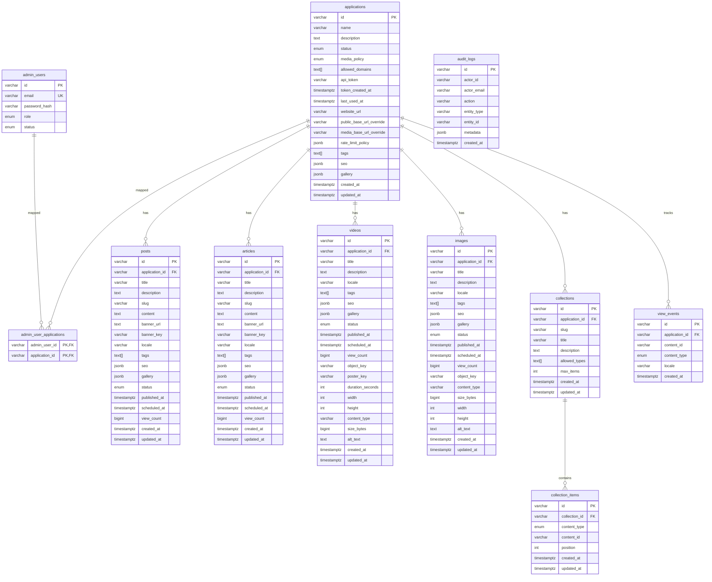
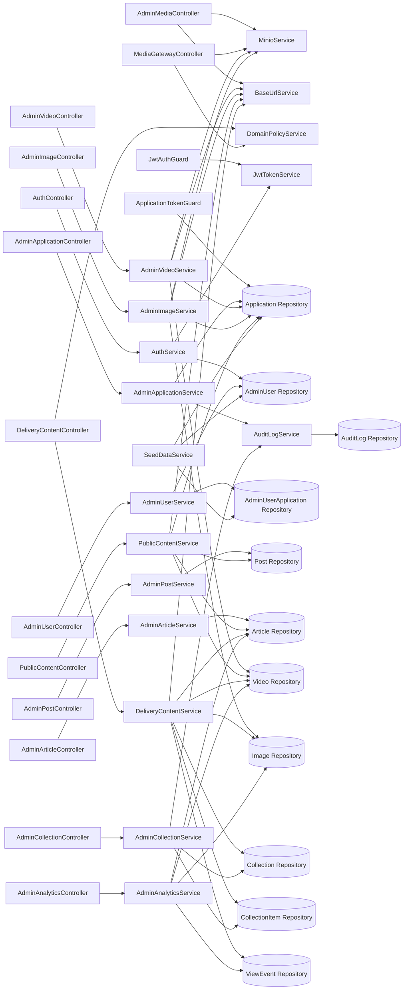

# Architecture Reference

This document contains the current backend architecture reference for the active NestJS implementation.

## ERD

## API Map

| Method | Path | Auth | Purpose |
|---|---|---|---|
| POST | `/api/v1/auth/login` | Public | Admin login |
| GET | `/api/v1/admin/applications` | Admin JWT | List applications |
| GET | `/api/v1/admin/applications/:id` | Admin JWT | Get application |
| POST | `/api/v1/admin/applications` | Admin JWT | Create application |
| PUT | `/api/v1/admin/applications/:id` | Admin JWT | Update application |
| POST | `/api/v1/admin/applications/:id/token/rotate` | Admin JWT | Rotate application token |
| POST | `/api/v1/admin/applications/:id/token/revoke` | Admin JWT | Revoke application token |
| DELETE | `/api/v1/admin/applications/:id` | Admin JWT | Delete application |
| GET | `/api/v1/admin/users` | Admin JWT | List admin users |
| GET | `/api/v1/admin/users/:id` | Admin JWT | Get admin user |
| POST | `/api/v1/admin/users` | Admin JWT | Create admin user |
| PUT | `/api/v1/admin/users/:id` | Admin JWT | Update admin user |
| DELETE | `/api/v1/admin/users/:id` | Admin JWT | Delete admin user |
| POST | `/api/v1/admin/posts` | Admin JWT | Create post |
| PUT | `/api/v1/admin/posts/:id` | Admin JWT | Update post |
| PATCH | `/api/v1/admin/posts/:id/status` | Admin JWT | Change post status |
| GET | `/api/v1/admin/posts` | Admin JWT | List posts |
| POST | `/api/v1/admin/articles` | Admin JWT | Create article |
| PUT | `/api/v1/admin/articles/:id` | Admin JWT | Update article |
| PATCH | `/api/v1/admin/articles/:id/status` | Admin JWT | Change article status |
| GET | `/api/v1/admin/articles` | Admin JWT | List articles |
| POST | `/api/v1/admin/videos/upload` | Admin JWT | Upload video |
| GET | `/api/v1/admin/videos/:id` | Admin JWT | Get video |
| PUT | `/api/v1/admin/videos/:id` | Admin JWT | Update video |
| PATCH | `/api/v1/admin/videos/:id/status` | Admin JWT | Change video status |
| GET | `/api/v1/admin/videos` | Admin JWT | List videos |
| POST | `/api/v1/admin/images/upload` | Admin JWT | Upload image |
| GET | `/api/v1/admin/images/:id` | Admin JWT | Get image |
| PUT | `/api/v1/admin/images/:id` | Admin JWT | Update image |
| PUT | `/api/v1/admin/images/:id/status` | Admin JWT | Change image status |
| GET | `/api/v1/admin/images` | Admin JWT | List images |
| POST | `/api/v1/admin/media/upload` | Admin JWT | Upload generic media |
| GET | `/api/v1/admin/collections` | Admin JWT | List collections |
| GET | `/api/v1/admin/collections/:id` | Admin JWT | Get collection |
| POST | `/api/v1/admin/collections` | Admin JWT | Create collection |
| PUT | `/api/v1/admin/collections/:id` | Admin JWT | Update collection |
| DELETE | `/api/v1/admin/collections/:id` | Admin JWT | Delete collection |
| GET | `/api/v1/admin/collections/:id/items` | Admin JWT | List collection items |
| POST | `/api/v1/admin/collections/:id/items` | Admin JWT | Add collection item |
| DELETE | `/api/v1/admin/collections/:id/items/:itemId` | Admin JWT | Remove collection item |
| PUT | `/api/v1/admin/collections/:id/items/reorder` | Admin JWT | Reorder collection items |
| GET | `/api/v1/admin/analytics/top` | Admin JWT | Top content analytics |
| GET | `/api/v1/admin/analytics/timeline` | Admin JWT | View timeline analytics |
| GET | `/api/v1/public/:applicationId/posts` | App Token | Public posts |
| GET | `/api/v1/public/:applicationId/posts/:slug` | App Token | Public post detail |
| GET | `/api/v1/public/:applicationId/articles` | App Token | Public articles |
| GET | `/api/v1/public/:applicationId/articles/:slug` | App Token | Public article detail |
| GET | `/api/v1/public/:applicationId/videos` | App Token | Public videos |
| GET | `/api/v1/public/:applicationId/videos/:id` | App Token | Public video detail |
| GET | `/api/v1/public/:applicationId/gallery` | App Token | Public gallery |
| GET | `/api/v1/public/:applicationId/gallery/:index` | App Token | Public gallery item |
| GET | `/delivery/v1/content` | App Token + Domain Policy | Delivery feed |
| GET | `/delivery/v1/collections/:slug` | App Token + Domain Policy | Delivery collection |
| POST | `/delivery/v1/events/view` | App Token | Register content view |
| GET | `/media/:appId/*` | Domain Policy | Media gateway stream |

## Service Dependency Graph

