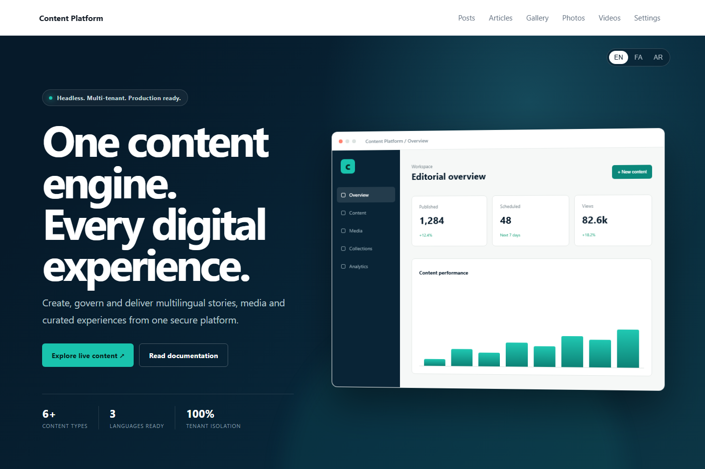

# Content Platform documentation

[English](README.md) · [فارسی](../fa/README.md) · [العربية](../ar/README.md)

Content Platform is a multi-tenant, API-first content infrastructure built with NestJS, PostgreSQL, MinIO, React and Next.js. One installation can securely power many websites and applications.



## Features

- Posts, articles, pages, images, galleries and videos
- Ordered collections for heroes, sliders, grids, banners and recommendations
- Localized delivery in English, Persian and Arabic
- Tenant-scoped users, permissions, applications and revocable API tokens
- Media variants, signed access, reference tracking and safe deletion
- Scheduling, audit logs, analytics, SEO and sitemap management
- React administration studio and server-rendered Next.js consumer demo

## Quick start

```bash
cp .env.example .env
docker compose -f docker-compose.nestjs.yml up --build
```

Open the API at `http://localhost:3001`, admin studio at `http://localhost:3002`, demo at `http://localhost:3003`, and MinIO at `http://localhost:9001`.

For direct development, run migrations and all three applications:

```bash
npm install
npm --prefix backend-nestjs run migration:run
npm run dev:all
```

## Secure delivery

Consumer credentials stay on the consumer server. Never expose the application token in browser code.

```http
GET /api/v1/content/posts?locale=en&page=1&pageSize=12
X-Application-Id: <application-id>
X-Application-Token: <application-token>
```

The delivery API includes content, posts, articles, videos, galleries, collections and view events under `/api/v1`.

## Editorial workflow

1. A system administrator creates an application and assigns editors.
2. Editors create localized content, reusable media and collections.
3. Content moves through draft, scheduled and published states.
4. Consumer servers fetch published content with application credentials.
5. Analytics and audit logs retain views, changes and media usage.

## Deployment

Copy `.env.example` and use strong production secrets. For CapRover, configure `CAPROVER_URL` and `CAPROVER_PASSWORD` in GitHub Actions and dispatch the deploy workflow. Attach HTTPS domains to the API, studio and demo apps.

See [architecture](../architecture/README.md), [delivery](../swagger-content-delivery.md), [safe media deletion](../safe-media-deletion.md), and [security](../../backend-nestjs/docs/security.md).
